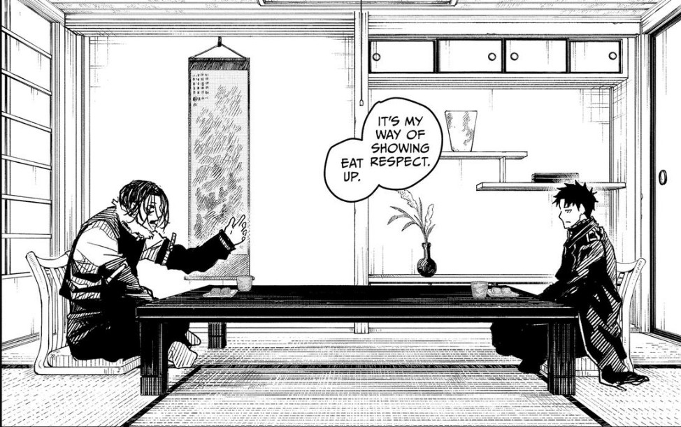
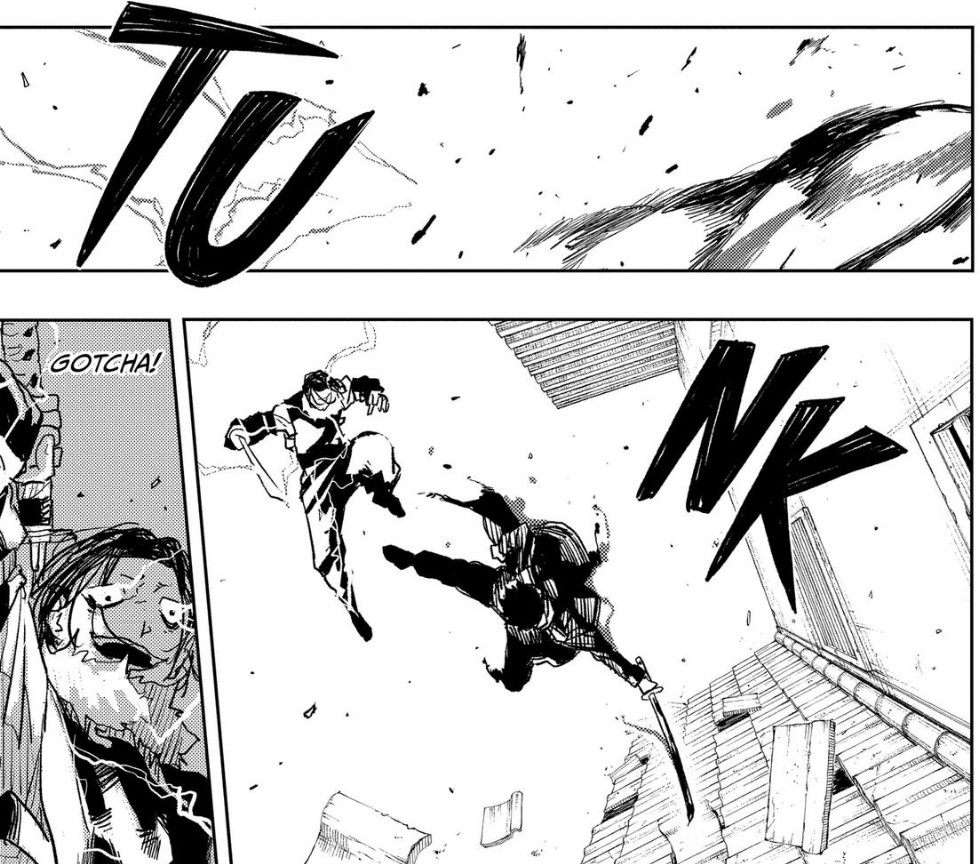
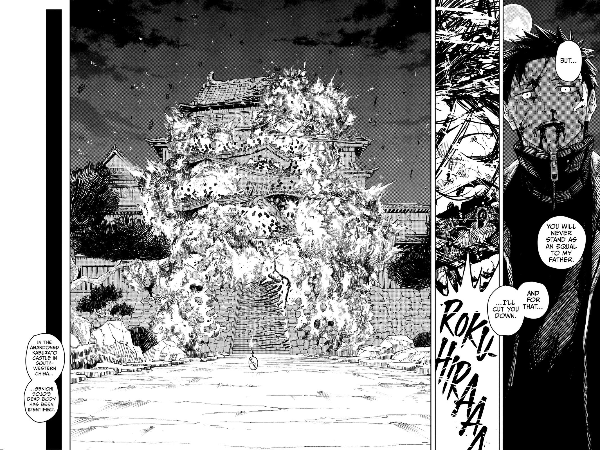

Kagurabachi is a sword fighting action shonen manga that i've been reading. it has cool fight, good story and peak panelling. one fight is particularly cool, has a particularly good story and particularly peak panelling, so i'm gonna write about it.

(this post contains spoilers for Kagurabachi.)

### prelude

in kagurabachi, the main character Chihiro aims to retrieve the six enchanted blades that were stolen after a group of sorcerers called the Hishaku killed his father Kunishige, the blacksmith that forged them.

Kunishige instilled in Chihiro a profound sense of responsibility regarding the creation and use of swords. He emphasized that katana should be wielded by those dedicated to vanquishing evil and protecting the weak.

the first villain that Chihiro has to deal with in the quest to retrieve the enchanted blades is Genichi Sojo, an arms dealer that was paid the EB Kuregumo by the Hishaku to research the source material of the blades, Datenseki. Sojo is violent and murderous, and revels in the belief that the EBs are meant as weapons of mass destruction, which isn't inherently wrong - swords at their core are weapons meant to maim and kill.

Chihiro and Sojo fight. In their first fight, Sojo directs Mei, a lightning spell, towards civilians. Chihiro understands that civilian casualties due to the EBs will shift public perception, so he copies Mei using his own ability and redirects the lightning toward himself, shattering his body. While Sojo calls forth another Mei, it fails, because as Chihiro recalls, Kuregumo has a 10 second cooldown on Mei. Therefore, he argues that Sojo is the one who doesn't understand anything.

Sojo escapes using the Kuregumo ability, Kou, while Chihiro is hospitalised for five days and rendered incapable of fighting. The Kamunabi (Japanese government) send the Anti-Kuregumo Special Forces, a group of sorcerers, to eliminate Sojo, while a wounded Chihiro infiltrates Sojo's base.

Sojo displays a wide variety of tactics using Kuregumo, such as running the current of Mei through the water of Kou, producing larger amounts of ice by freezing the water of Kou with Yui, and most importantly, applying the principle of 'lightning attracts lightning' that he learned from Chihiro to the Kuregumo by blasting himself towards his blade when they were separated. Sojo learned from his encounter with Chihiro, and stepped into the true realm of the enchanted blades.

Chihiro additionally grows in his infiltration of Sojo's base. Due to his injuries, he cannot fight effectively. Chihiro has a flashback: one time, he was feeling doubtful about his goal of becoming a swordsmith like his father, to which Kunishige assured him that it was true, Chihiro could never be like him. He says, "Don't get too fixated, if you follow in my footsteps, it'll be a waste that you were born as Chihiro Rokuhira." and gave Chihiro the advice: "Keep a cool head, and be flexible." Chihiro adapts Kuro into 
Kuro Shred, by consuming an equal amount of spirit energy as a regular Kuro to create twenty targetted, more compact slashes, lessening the strain on the body. Moreover, Chihiro adapts Nishiki by using spirit energy to aid his movement instead of boosting his movement. In learning from their past experiences, Chihiro and Sojo both grow in their own interpretation of their EBs.

The two meet in the courtyard of the castle. Sojo tells Chihiro that they had much to discuss, but what they needed now, wasn't words. The tension builds up, as the narrator sets up the battle: a twelve-second high speed duel. the way this is done evokes old Western films - a tumbleweed rolls across the desert as the two gunmen's hands lay on their guns. This is a duel compressed into a heartbeat, recalling not just *Rurouni Kenshin*, but Kurosawa’s *Sanjuro* and the classic Western “high noon” archetype.

'the battle would last only a mere moment.' says the narrator as Sojo and Chihiro cloak themselves in Mei and Nishiki respectively, and disappear from the screen.

### the fight

the first shot is a top-down view of Chihiro and Sojo in the air above the castle's front battlements with swords at the ready. they clash swords, with the force of the clash tearing apart the roof tiles.

the initial clash is followed by a shot of Chihiro and Sojo conversing in a tearoom, and the title of the chapter: Chapter 17 - Tea. By having Chihiro and Sojo sit in this imagined tearoom mid-battle, the manga plays with the paradox of civility versus violence.

Sojo shares with Chihiro his love of dango. He tells Chihiro, "it's my way of showing respect, so eat up." Chihiro declines, saying that he doesn't like sweets. This is significant — dango represents small human comforts, nostalgia, and sweetness. Sojo clings to it as a reminder of humanity, while Chihiro, marked by trauma, rejects childish pleasures. It is not just banter; it’s philosophy hidden in food.

Sojo talks to Chihiro about Kunishige. He offers up his belief of the EBs being weapons of mass destruction, but Chihiro disagrees. He says that he saw the way that Kunishige approached the swords every day, but Sojo says that the message that he got from Kunishige's work was slaughter. Though he is interested in how Rokuhira was really like, he ultimately refuses to know, saying that he believed in his interpretation, and the fact remained that Kuregumo answered his conviction to use it to kill.

In real time, Chihiro kicks Sojo off of the battlements.

 Sojo lifts his blade, but Chihiro stops his sword arm with his leg, and prepares a strike of his own. As they fall, Chihiro cuts down at Sojo, but Sojo dodges, and applies Mei to teleport Kuregumo from his right hand to his left, catching Chihiro off guard with a slash to his head.

 

With nine seconds remaining, Chihiro blocks the attack with his own right arm, causing it to be sliced off at the elbow, deflecting the attack just barely. Sojo and Chihiro race around the courtyard, noting that they were both significantly stronger than before.

In the tearoom, Sojo tells Chihiro that he wasn't the only one that could speak for Rokuhira, neither of them could. This recalls the bushidō ideal that combat reveals truth — words lie, blades do not.

In real time, with seven seconds left, Sojo broke down his and Chihiro's options - other than Nishiki, Chihiro had three moves - long distance slashes (Kuro and Kuro Shred), self-defense tactics that nullify Mei (Aka), as well as charge that he uses to divert Mei (Aka). He notes that at this high speed, his best move was to deliver a finishing hit using Mei. If he were to use another move, his spirit energy would run out, and his movement would be restricted.

Sojo throws away his pride and any other tactics, and doubles his spirit energy consumption, cutting down his Mei duration from six seconds to three seconds, significantly upping his speed and closing down on Chihiro from behind him.

In the tearoom, Chihiro picks up a stick of dango.

In real time, Sojo swings at Chihiro, but Chihiro blows past him, dodging the attack and slashing at Sojo's neck, cutting open his scarf.

In the tearoom, Chihiro takes a bite of the dango. He thinks back to Kunishige saying that katanas 'are tools for killing people.', and that 'this isn't necessarily the right answer, you have to look at the world through your own eyes.' Chihiro works his way through the dango with difficulty, and swallows. He tells Sojo that he accepts his belief. Both of them could speak for Kunishige, which was exactly why Chihiro couldn't show Sojo any respect. Chihiro renews his resolve to cut Sojo down with thicker bloodlust. This sequence is a perfect visualization of combat as dialogue: Chihiro digests Sojo’s philosophy — literally — but still rejects it.

In real time, Sojo tracks Chihiro, seeing him go above him. He follows through his previous attack by swinging into the air, but Chihiro is faster. He's already behind Sojo, and has cut off his left arm. Sojo pivots in place in an attempt to follow Chihiro, but he's able to remain in his blind spot. At this point, the narrator reveals that Chihiro had cloaked himself in three times the amount of spirit energy that his body would normally allow.

Even so, Sojo can react. As Chihiro closes in for a finishing blow with one second left, Sojo summons the dregs of his spirit energy to cut Chihiro's throat.

Chihiro dispels the speed boost granted by Nishiki, ending his step-in and causing Sojo's attack to overshoot, and summons Kuro, recalling all of his experiences forging swords with his father. 

Chihiro releases it at point-blank range, cleaving through Kuregumo, Sojo and many of the ornamental trees and plants in the courtyard.

### the ending

Sojo admits defeat, saying that the enchanted blades chose Chihiro. Chihiro looks down at the fragments of Kuregumo and disagrees, saying that they chose Sojo too. As he continues his sentence, the scene cuts off. This is an important note: Chihiro doesn’t say Sojo was wrong — just that his interpretation was incomplete. Both men embodied Kunishige’s legacy, but Chihiro proved flexible, while Sojo overconsumed, overcommitted, and burned out.

Chihiro is retrieved by his allies, as Sojo, bleeding out, crawls into the castle and into his lab, where he retrieves a piece of Datenseki. He says that he understands the enchanted blades now, that he can control its power. However, the Datenseki's spirit power overloads him, causing his body to rupture violently. Sojo questions what was missing? After all, the enchanted blades had chosen him as much as they had chosen Chihiro.

Then, what Chihiro told Sojo is revealed - "but, you will never stand as an equal to my father. and for that, i'll cut you down." Sojo, defeated and dying, curses the Rokuhira name as the castle explodes in a majestic ball of flame.

---

### Thematic Wrap-up

This fight isn’t just about swordsmanship. It’s about **weapons as mirrors of ideology:** the blades reflect the wielder’s truth, whether protection or slaughter, as well as **acceptance and rejection:** Chihiro digests Sojo’s worldview but ultimately denies it respect, proving his resolve.

By alternating still, symbolic interludes with frenetic battle panels, Kagurabachi captures both the *external* and *internal* duel, pulling from traditions of chanoyu, Kurosawa, Westerns, and shonen rivals. 

Basically, kagurabachi is hella cool lol go read
