Hollow Knight: Silksong released on September 4th, 2025, amidst countless other games postponing their releases to make way for the return of the king, putting an end to seven years worth of <span class="tooltip" data-tooltip="the loving term coined by the HK community to refer to low effort posts meant to bait people into believing misinformation (such as fake release dates)">Silkposts</span>.

(oh wait nevermind, the silkpost tag seems to be ever more prevalent in r/Silksong)

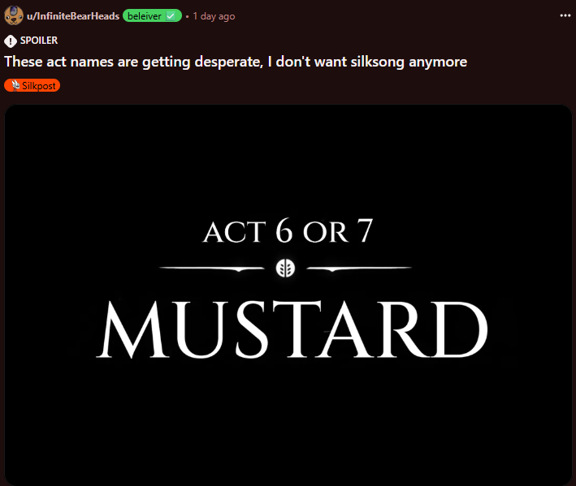

Team Cherry mentioned that the seven year development cycle wasn't due to development hell. In fact, the team had so much fun developing it and adding on to the game that it would probably have been better to call it "development heaven". 

## the difficulty

Silksong is difficult. Though this could be because of the fact that the community has forgotten the difficulty of playing through hollow knight for the first time, the challenge can be seen in Silksong in multiple areas, such as the fact that this annoying little baby croc thing can do as much damage per attack as the literal god of the sun.

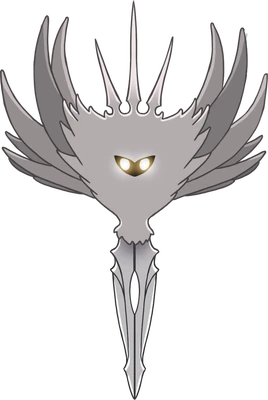

<i>Above: the Radiance, final boss of Hollow Knight, god of the sun, lord of all that is unholy, source of the plague, the infection, the madness that haunts the corpses of Hallownest... the light that screams out from the eyes of this dead Kingdom.</i>


<i>Above: a muckroach, an enemy found in sinner's road that can pounce on you and stuff. </i>

As they say, King's Pass is the tutorial for Hollow Knight, and Hollow Knight is the tutorial for Silksong.

## hornet

Silksong was originally planned to be a DLC for the original game, meant to add on to the existing map with playable content for Hornet. However, Hornet is bigger than the Knight, and the new agile movement didnt work well with the existing map. The areas of Pharloom are definitely meant to fit Hornet with the wider caves.

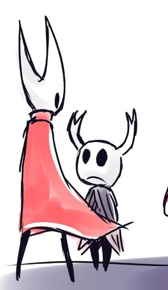

For better or for worse, Hornet doesn't constantly make those funny sounds when she dashes around. (Sounds = "<span class="tooltip" data-tooltip="also known as 'git gud'">gekk tuu</span>", "shaw", "edino", etc). It's true that it would probably be annoying as hell having to hear it all the time, but it's still pretty unfortunate.

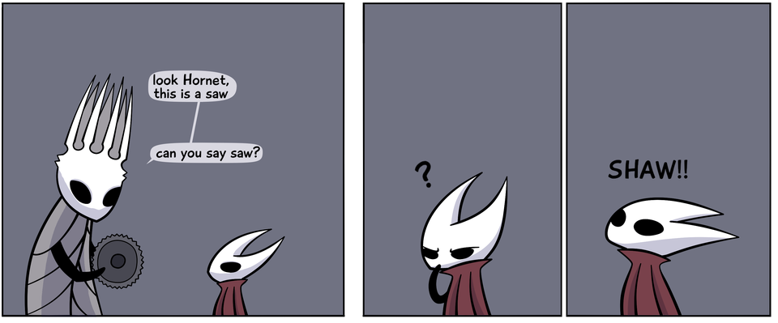

### health

Hornet has five masks at the start of the game, same as the Knight. However, where in the original game the Knight healed individual masks by focusing a third of his Soul bar, Hornet heals by using Bind, which consumes the entire Silk bar to heal three masks at a time, and makes it possible to heal in midair. In exchange for this, healing has become more punishing, as a high risk high reward move. 

### exploration abilities

Like the powerups in Hollow Knight, Hornet learns more abilities by exploring the map. A lot of them are derivative of the existing powerups from HK, such as the Mantis Claw/Cling Grip, which lets you walljump, and the Monarch Wings/Faydown Cloak, which lets you double jump.

However, Hornet does have new abilities that complement the build more, such as the Drifter's Cloak which lets you glide and Swift Step, which serves as a sprint.


Instead of using the Dream Nail to read an NPC's dialogue, Hornet can play the Needolin. Comparably less violent than stabbing them, and it ties into the themes of Silk and Song.

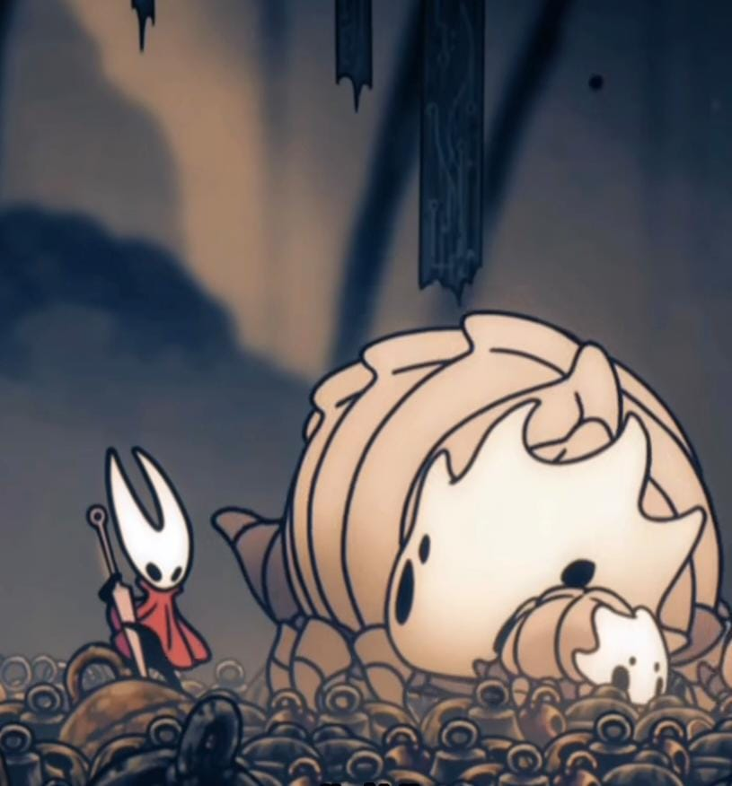
<i>did i mention that the bell beast is the absolute cutest thing ever?</i>

### crests

The default Hornet pogo is the 45 degree diagonal one that everyone on the Internet is complaining about. However, this can be changed with the Crest system, which fundamentally changes Hornet's playstyle. Every crest allows for different amounts of equippables and skills.

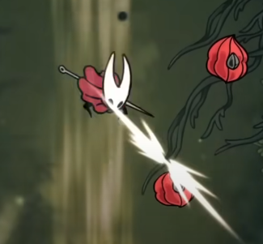

For example, the default crest (with the annoying ahh pogo) is the Hunter crest.

The Reaper crest can be found at the Chapel of the Reaper in Greymoor, and makes your attacks slower, but when you Bind, your attacks will spawn silk orbs when landed, allowing you to max out Silk faster.

The Wanderer crest can be found at Moss Grotto in the Chapel of the Wanderer. Functionally, it's the same as the combat of the Knight from the original game, with vertical pogo and short-range attacks.

There are more crests available in the game, but I either haven't found them yet or gave up trying to get them (looking at you, savage beastfly)

### tools and traps
Hornet can make use of tools and traps in combat. For example, throwing knives can be found in the bench room before the entrance to Hunter's March and allow for quick damage dealing at range. 

Sting Shards are the spike ball traps that Hornet uses in the main game that zones out enemies and does damage. 

Tacks can be placed on the ground to do a similar function.

### dialogue

A cute little detail present in the game is that the NPC talk prompt is "Speak" instead of "Listen", because Hornet isn't a silent protagonist like the Knight. She has dialogue, and she speaks with a really respectful tone.

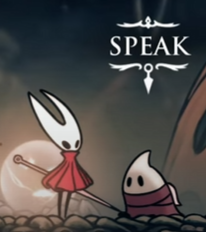


### the hunter's journal

Hornet can receive a Hunter's Journal from an NPC at Halfway Home in Greymoor. It's functionally the same as the Hunter's Journal from the original game, except for the fact that Hornet is the one writing the notes. These blurbs lead to some cute insights into her character, such as:

her love for fluffy things. (image source Hollow Knight Wiki)

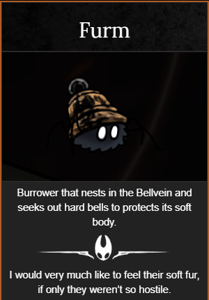
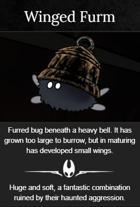

## the world

Pharloom is a religious kingdom. Many, many pilgrims visit the kingdom on their pilgrimage to the structure at Pharloom's summit, the Citadel. One of the currencies in the game, arguably the more valuable one, is Rosaries, dropped by civilised bugs. 

The world is lively, if not more lively than Hallownest. There are plenty of memorable NPCs on their own journeys that happen to intersect with your own. If you complete quests in Bellhart, the NPCs even give you ownership of your own Bellhome (albeit devoid of furniture, which you must buy for exorbitant amounts of rosaries in the shop)

For instance, Shakra is a chakram wielding warrior off to find her master, who practices cartography and is more than happy to sell us her maps. She can be identified by the chakrams lying around on the ground, as well as the beautiful singing (mirroring the way we identified Cornifer in HK, by the maps and humming)


Garmond is a travelling warrior with his noble steed, Zaza. They can help you fight certain bosses, and they show up every now and then later in the game, helping you clear random encounters. (their quest is also ~~sniffle~~ really well written ~~wipes away tears~~ im not crying your crying, shut up ~~profusely blows nose~~)

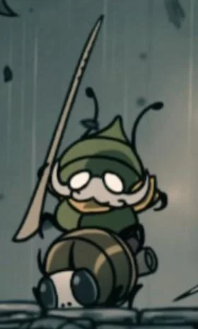

There are quests available in the game, accessable through the Wish boards in towns like Bone Bottom and Bellhart. The boards allow you to fulfill the wishes of certain bugs in the kingdom, which can have impacts on the world. For example, if you donate to repairing the town's buildings, maybe when you return you'll find a bridge covering that massive pothole that you had to jump over before.

### lace

Lace is the recurring rival character, with a mahito ahh personality. Functionally, they are Hornet's Hornet, showing up multiple times to fight the main character. I really like Lace's movement and fight, it's an easy early fight but I still died multiple times to her for no reason other than to fight in as much style as possible.

### the start of the game

did you know that if you go to the right in the first room and jump into the wall, there's a hidden room?
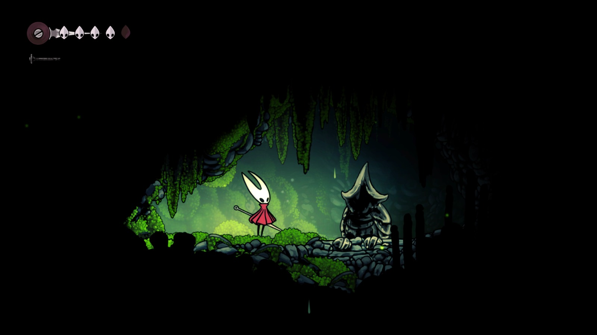

maybe some of you veteran explorers were on your toes and checked, and now you feel proud of yourself. good job, give yourself a pat on your back. 

or not, because there's another hidden room inside the hidden room with a secret boss inside. look out though, because it deals two masks per hit. have fun!

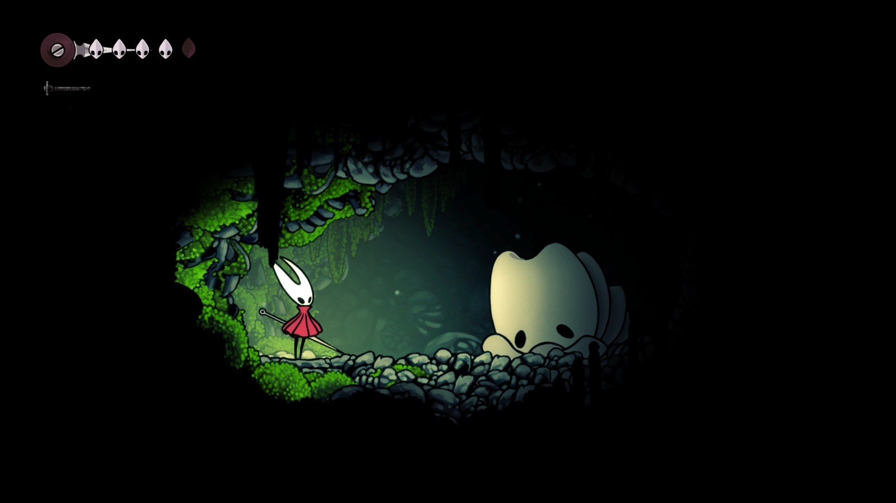

### the prison

there's a segment where it's possible to get kidnapped by a fly while in certain areas of the game. The fly will trap you in a cage and strip you of your cloak, tools and needle.

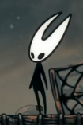

<i> uhh i dont think thats what the gooners meant when they asked to see hornet naked in silksong...</i>

You are brought to the Slab, an extensive prison complex near the frigid Mount Fay, and you have to fight your way through the prison to retrieve your tools and find your way out.

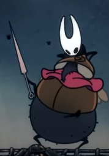
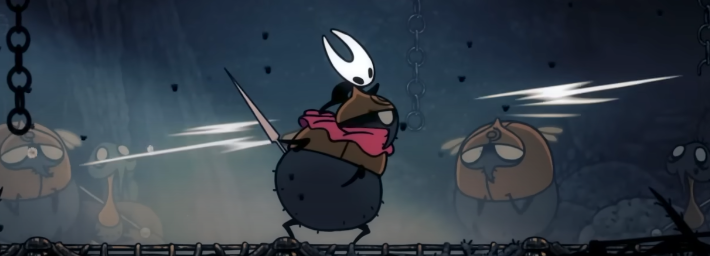
<i>DRIP RECLAIMED</i>

it was a cool little segment, but it happened right in the middle of me making the long trek back to Sinner's Road, which effectively killed off all my motivation for returning there ever again. I heard there was a really cool area called Bilewater something that can be accessed from Sinner's Road. What a shame.

## themes

_They see your beauty, so frail and fine,_

_They see your peace, woven of faith and toil,_

_They forget your heart, bound in slumber and servitude,_

_When you wake they shall see your truth,_

_A beast's nature bare to all._

_-- 'Pharloom's Folly'_


### motherhood

Motherhood permeates Silksong. Hornet, daughter of the Pale King and Herrah the Beast, rediscovers her maternal heritage through the Weavers. The first boss, Moss Mother, spawns grub-like children. Shakra mentions her mother-daughter bond with her master. The Broodfeast quest tasks Hornet with gathering food for Huntress’s children.

#### grand mother silk: fertility and parenthood

The final boss, and overarching antagonist of the game, is a higher being called "Grand Mother Silk". Infertility and in-vitro fertilisation is a theme of Silksong: GMS can’t have a true child of her own so keeps creating artificial children in the Weavers, Lace, and Phantom. The Weavers are noted to have difficulty conceiving and birthing, and Hornet even notes that she is infertile. 

(spoilers) mother sacrifices herself for her child, transferring all her remaining power to Hornet so that she can escape the Abyss safely with Lace.

#### red memory: parenthood 
In the Red Memory segment, there's a short scene of Hornet growing up.

Here, Hornet is surrounded by Weavers.

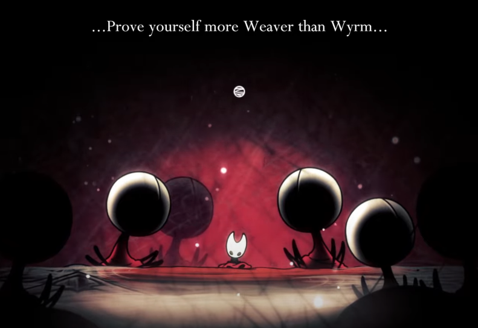
<i>awwww</i>

she was trained to fight in the Hive by the Queen Bee, which is a different form of mothership (also, this kind of explains why Hornet loves fuzzy things so much, being that she grew up in the Hive with all the bees)

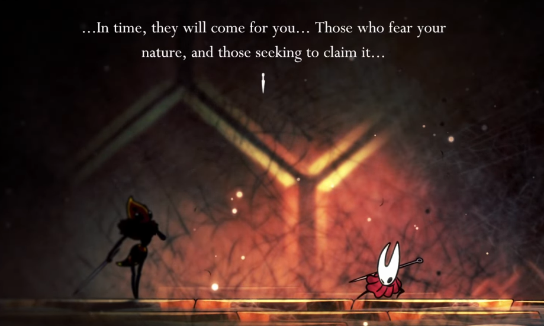

she received guidance from her stepmother, the White Lady, which is yet another kind of mothership

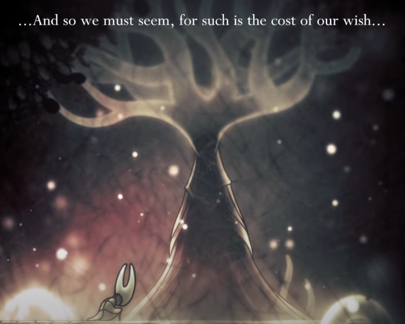

While some players read the King’s indirect presence in the flashback as proof that Hornet hates or dismisses him, it's not really that simple.

From the start, the Pale King has always been an absent father, "a character defined by his absence". In Hollow Knight, his presence was felt through architecture and NPC dialogue. Showing him too directly would break the series’ aesthetic of distance and mystery. In Silksong, his leitmotif plays. The King is present, to a painful amount.

What makes the sequence powerful is how Hornet responds to him compared to her other parental figures. She learned independence from Herrah. She learned toughness and resilience from Vespa. But when it comes to the Pale King, Hornet nearly refuses to name what she inherited from him, almost as though she was ashamed. This comes after the disastrous mishap in Pharloom, where Hornet feels guilty and self-condemned. When she writes about the Wingmoulds as “crude constructs from my father’s fallen domain” and calls anyone who meddles with the Void a fool, she is really condemning herself. Hornet is scared that the thing she inherited from the King (beyond their shared love of traps) is his failure to protect what they care about and the crushing weight of watching it crumble.

Hornet is not just repeating his path. She is being tested by a similar burden: incomplete knowledge, overwhelming responsibility, the temptation of alluring power, and the trust of the friends who depend on her. The flashback therefore becomes less about her rejecting her father than about confronting the part of herself that resembles him.

When the White Lady admits that she and the King may seem unrepentant, even hateful, Hornet’s reply is that she does not hate them. She understands them better with age. Despite disagreements and mistakes, all her parental figures - Herrah, Vespa, the White Lady, and even the Pale King just wanted her to be strong and independent, to live differently from them, and not to be crushed by the mistakes that they made. Just as any parent would want their child to be better than them, all of Hornet's guardians only wanted the best from her.

Hornet’s arc is one of acceptance. She is Hallownest’s daughter, but she will not be bound by its failures.

#### rite of rebirth

There's a weird little sidequest called Rite of Rebirth. You meet an NPC called Greyroot, who you can bring a twisted bud to. The twisted bud is absolutely disgusting, it wriggles and screeches inside your inventory, and sends shivers down my spine and i absolutely hate it.


It begins with Greyroot offering Hornet simple quests, which is a good thing! She helps her, she gets a reward, her usual. Hornet is a bug that is kindhearted despite herself, showing warmth until she can't, and so it's very easy for Greyroot to earn her trust and cooperation.

Greyroot implants the twisted bud within Hornet, which has  undertones of assault. The sequence is very visceral and abrupt. The bud infests Hornet, and we know that it is a parasite that will eventually kill her if it hatches, a la Alien.

 The infestation prevents you from healing. If you complete the game with the curse (somehow), you get an exclusive ending, but there's a way you can remove the curse: by going to a quack doctor (who was exiled for malpractice) that removes the parasite in an agonising sequence.

 Even after removing the parasite, Hornet is left with the Crest of the Witch. Hornet has lasting scars from the event. She does not simply forget about it and go on, she bears the experience and makes it anew, wearing the very crest on her shell. Rather the contrary, using it as momentum in the form of a crest.

As u/jasonjr9 wrote in a comment in <a href="https://www.reddit.com/r/HollowKnight/comments/1nju3vc/comment/neu3tya/?utm_source=share&utm_medium=web3x&utm_name=web3xcss&utm_term=1&utm_content=share_button"> this thread </a>, 
```
Considering the way it kills Hornet to be born in the Greyroot ending, perhaps it could be an analogy for pregnancy complications resulting in the death of a mother who became pregnant after an assault. And the way she had to turn to shady sources to “abort” the cursed being within her by removing it because the society in Pharloom is religious, paralleling religious opposition to abortion in real life.
```

The ending in which Hornet is killed when the parasite rips its way out of her could be viewed, similarly, as a metaphor for a mother dying due to birth complications.

All in all, this is a really cool sidequest that delves into some really deep themes and communicates them in a really memorable way.

## conclusion
Silksong is a mirror held up to Hollow Knight and it fleshes its world out a lot more. By placing Hornet at the center, Team Cherry takes themes that were once implied and makes them intimate. It’s a story about learning from the past without being shackled to it, and about carrying burdens that may never fully heal.

Basically, go play Silksong, gamers.

