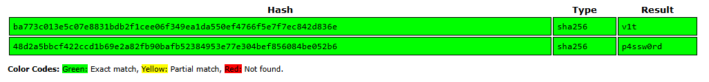
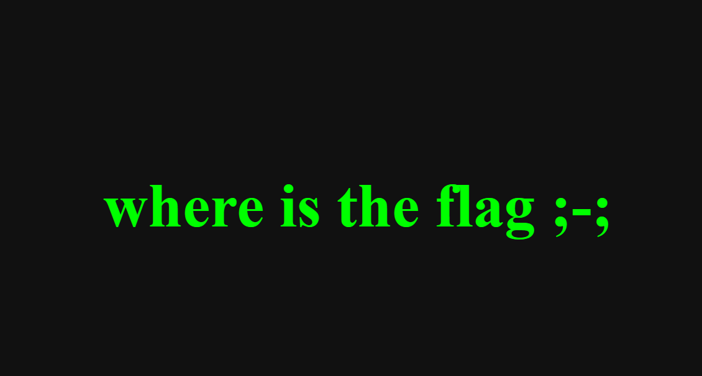
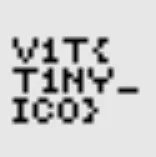
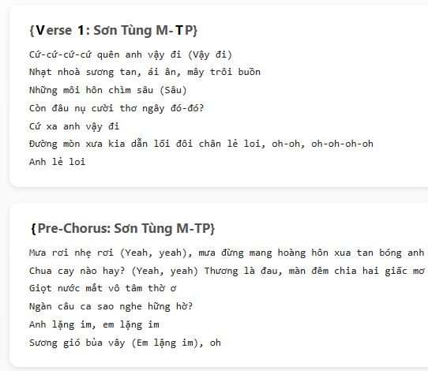
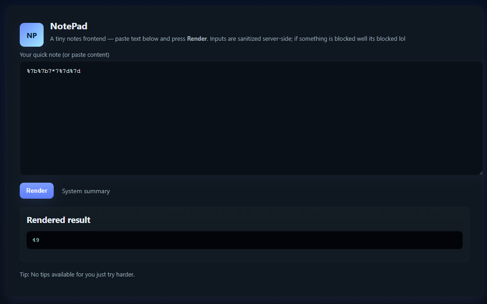
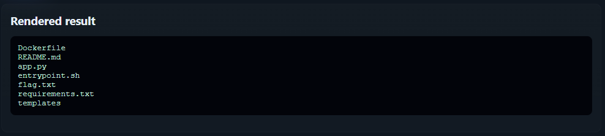
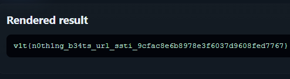

## > Login Panel (Web)

A fully client-side chal. 

```js
async function toHex(buffer) {
      const bytes = new Uint8Array(buffer);
      let hex = '';
      for (let i = 0; i < bytes.length; i++) {
        hex += bytes[i].toString(16).padStart(2, '0');
      }
      return hex;
    }

    async function sha256Hex(str) {
      const enc = new TextEncoder();
      const data = enc.encode(str);
      const digest = await crypto.subtle.digest('SHA-256', data);
      return toHex(digest);
    }

    function timingSafeEqualHex(a, b) {
      if (a.length !== b.length) return false;
      let diff = 0;
      for (let i = 0; i < a.length; i++) {
        diff |= a.charCodeAt(i) ^ b.charCodeAt(i);
      }
      return diff === 0;
    }

    (async () => {
      const ajnsdjkamsf = 'ba773c013e5c07e8831bdb2f1cee06f349ea1da550ef4766f5e7f7ec842d836e'; // replace
      const lanfffiewnu = '48d2a5bbcf422ccd1b69e2a82fb90bafb52384953e77e304bef856084be052b6'; // replace

      const username = prompt('Enter username:');
      const password = prompt('Enter password:');

      if (username === null || password === null) {
        alert('Missing username or password');
        return;
      }

      const uHash = await sha256Hex(username);
      const pHash = await sha256Hex(password);

      if (timingSafeEqualHex(uHash, ajnsdjkamsf) && timingSafeEqualHex(pHash, lanfffiewnu)) {
        alert(username+ '{'+password+'}');
      } else {
        alert('Invalid credentials');
      }
    })();
```

The username and password have been <span class="tooltip" data-tooltip="An algorithm that transforms data of any size into a fixed-size string of characters. It is one-way, deterministic and always produces 32 bytes of output (256bits)">hashed</span> with SHA256. 

Dump the username and password into a platform like [crackstation](https://crackstation.net).



From the code above, we can see that the username and password form the flag. 

Flag: `v1t{p4ssw0rd}`

## > Stylish Flag (Web)



From the challenge title "stylish flag", we should look at the styles, otherwise known as the CSS that styles the site.

```css
.flag {
        width: 8px;
        height: 8px;
        background: #0f0;
        transform: rotate(180deg);
        opacity: 0.05;
        box-shadow:
            264px 0px #0f0,
            1200px 0px #0f0,
            0px 8px #0f0,
            32px 8px #0f0,
            88px 8px #0f0,
            96px 8px #0f0,
            160px 8px...
```

The box shadow styles the flag div into a grid, forming an image.

Just plot all coordinates on a grid, and visualise.
Here's a solve script generated by ChatGPT.

```python
import re
from PIL import Image, ImageDraw

css = r"""
 .flag {
        width: 8px;
        height: 8px;
        background: #0f0;
        transform: rotate(180deg);
        opacity: 0.05;
        box-shadow:
            264px 0px #0f0,
            1200px 0px #0f0,
            0px 8px #0f0,
            32px 8px #0f0,
            88px 8px #0f0
            ...
            1192px 64px #0f0,
            1200px 64px #0f0;
    }
"""

pairs = re.findall(r'(-?\d+)px\s+(-?\d+)px', css)
coords = [(int(x), int(y)) for x, y in pairs]
pixel_size = 8
grid = [(x // pixel_size, y // pixel_size) for x, y in coords]

max_x = max(x for x, _ in grid)
max_y = max(y for _, y in grid)

img = Image.new("RGB", ((max_x + 2) * pixel_size, (max_y + 2) * pixel_size), (0, 0, 0))
draw = ImageDraw.Draw(img)

for gx, gy in grid:
    x0 = gx * pixel_size
    y0 = gy * pixel_size
    draw.rectangle([x0, y0, x0 + pixel_size - 1, y0 + pixel_size - 1], fill=(0, 255, 0))

rotated = img.rotate(180)

rotated.save("flag.png")
rotated.show()

print("✅ Image saved as flag.png")
```

The image is the flag, but the text is upside down. Invert it, and obtain the flag:

Flag: `v1t{h1d30ut_css}`

## > Tiny Flag (Web)

Literally just check the <span class="tooltip" data-tooltip="A favicon (short for favorite icon) is the small icon that represents a website, usually shown in places like the browser tab next to the page title.">favicon.ico</span>.



Flag: `v1t{t1ny_ic0}`

## > Mark The Lyrics (Web)



Some lyrics. Hey, some letters are highlighted.

Viewing the HTML source reveals multiple <span class="tooltip" data-tooltip="Apparently, typically used to highlight text in HTML. Never heard of it before this chal.">`<mark>`</span> tags scattered all over the lyrics.

To find the flag, literally just concatenate the contents of all `mark` tags.

Flag: `v1t{mck-pap-cool-ooh-yeah}`

## > 5571 (Web)

Challenge name looks like SSTI

The template renderer site is also a staple of Web SSTI chals.

Inspecting the HTML, we can see that these literals are blocked in the backend.
```html
<!--
BLOCKED_LITERALS = [
  '{', '}', '__', 'open', 'os', 'subprocess', 'import', 'eval', 'exec',
  'system', 'popen', 'builtins', 'globals', 'locals', 'getattr', 'setattr',
  'class', 'compile', 'inspect'
]
-->
```

Simple introspection of <span class="tooltip" data-tooltip="Evaluates to 49 in template engines such as Flask. Perhaps {{6*7}} would be more suitable in these turbulent times.">{{7*7}}</span> yields the error `Error: Input blocked: literal token '{' not allowed. Try encoding.
`

In SSTI, the next step past the initial payload is using url encoding. For example, `{{7*7}}` is `%7b%7b7*7%7d%7d` <span class="tooltip" data-tooltip="Characters like { and } are sent as %7B and %7D in URLs and form bodies (application/x-www-form-urlencoded). That encoding is just a transport encoding, and the server typically decodes it back to {/} before using the value.">when url-encoded</span>.



It works. We move on to arbitrary file read via RCE:

`{{ self._TemplateReference__context.cycler.__init__.__globals__.os.popen('ls').read() }}`



Read `flag.txt`:
`{{ self._TemplateReference__context.cycler.__init__.__globals__.os.popen('cat flag.txt').read() }}`



Flag: `v1t{n0th1ng_b34ts_url_ssti_9cfac8e6b8978e3f6037d9608fed7767}`
